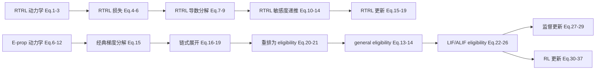

# RTRL 与 E-prop 两篇论文核心公式的中文深度解析与逐步推导

## 执行摘要

用户已提供两篇 PDF：一篇是 Williams 与 Zipser 的 **RTRL** 经典论文 *A Learning Algorithm for Continually Running Fully Recurrent Neural Networks*，另一篇是 Bellec 等人的 **E-prop** 论文 *A solution to the learning dilemma for recurrent networks of spiking neurons*。以下报告严格以这两篇原始论文 PDF 为首要依据展开，不额外引入次级综述文献作为主证据。fileciteturn0file1 fileciteturn0file0

这两篇论文的核心关系可以先用一句话概括：**RTRL 给出了循环网络在线精确梯度的前向递推形式；E-prop 则把循环网络梯度重写为“学习信号 × eligibility trace”的和，其中 eligibility trace 部分是严格前向、局部、可在线递推的，而学习信号部分用在线可得的近似量替代了需要反向穿越时间的信息。** 前者是“精确但昂贵”的在线梯度，后者是“局部且高效”的在线近似梯度。RTRL 的关键状态量是三指标敏感度张量 \(p_{ij}^k(t)=\partial y_k(t)/\partial w_{ij}\)；E-prop 的关键状态量是 eligibility vector / trace \(\epsilon_{ji}^t, e_{ji}^t\)，并把总梯度写成 \(\sum_t L_j^t e_{ji}^t\)。fileciteturn0file1 fileciteturn0file0

从公式层面看，RTRL 的核心递推式本质上是在维护“**每个参数如何影响当前所有神经元输出**”；E-prop 的核心递推式则是在维护“**每条突触对当前神经元可见状态的局部可计算影响**”。因此，**RTRL 的状态量维度带有额外的神经元索引 \(k\)**，需要覆盖整个网络的非局部影响；而 **E-prop 刻意把未来通过其他神经元传播的那部分影响移出 eligibility trace，交给学习信号 \(L_j^t\)**，进而把在线可算部分保留为局部递推。论文明确指出，E-prop 的 exact 形式在理想学习信号 \(dE/dz_j^t\) 下是严格成立的；真正的近似来自把该量替换为在线可得的 \(\partial E/\partial z_j^t\) 或其广播近似。fileciteturn0file0

更细致地说，E-prop 相对于 RTRL 做了三层“裁剪/重排”。第一层是**代数重排**：从经典 BPTT/RNN 梯度分解式出发，将梯度整理为 \(\sum_t L_j^t e_{ji}^t\)。第二层是**信息裁剪**：把 \(L_j^t=dE/dz_j^t\) 近似为只保留当前误差的在线学习信号。第三层是**模型简化**：对 ALIF 神经元的 eligibility 递推，论文还给出一个更可解释的近似式，显式丢弃 \(-\psi_j^t\beta\) 项。也就是说，**E-prop 的局部 eligibility 递推并非近似；近似主要发生在学习信号和少部分慢变量递推的简化上。** fileciteturn0file0

从教学角度，如果只想把握本质，可把两文的核心对应关系记成：

\[
\text{RTRL:}\quad 
\frac{\partial y_k(t)}{\partial w_{ij}}
\Longrightarrow
\Delta w_{ij}(t)\propto \sum_k e_k(t)\,p_{ij}^k(t)
\]

\[
\text{E-prop:}\quad
\frac{dE}{dW_{ji}}
=
\sum_t
L_j^t\,e_{ji}^t
\approx
\sum_t
\widetilde L_j^t\,e_{ji}^t
\]

二者都在做“在线前向更新一个梯度相关状态量”，但 RTRL 跟踪的是**全网络敏感度**，E-prop 跟踪的是**局部 eligibility**。fileciteturn0file1 fileciteturn0file0

## 文献范围、记号与假设

### 文献范围

本报告仅以用户提供的两篇论文 PDF 为主源：

- **RTRL 论文**：Williams & Zipser, 1989，*A Learning Algorithm for Continually Running Fully Recurrent Neural Networks*。fileciteturn0file1
- **E-prop 论文**：Bellec et al., 2020，*A solution to the learning dilemma for recurrent networks of spiking neurons*。fileciteturn0file0

需要特别说明的是，E-prop 主文中若干推导步骤（尤其监督学习 readout 的在线化、强化学习 Eq. (36)–(37) 的完整细节）明确写着 “see Supplementary Note”，而补充材料 **不在本次提供的 PDF 中**。因此，下面相应部分我会做**严格的主文重构推导**，并在“歧义与未明示步骤”部分显式标注哪些细节属于论文主文未完全展开之处。fileciteturn0file0

### 统一记号表

为便于比较，先把两文记号统一。

| 记号 | RTRL 中含义 | E-prop 中含义 | 备注 |
|---|---|---|---|
| \(t\) | 离散时间步 | 离散时间步，通常 \(1\,\mathrm{ms}\) | 两文都使用离散时间。fileciteturn0file1 fileciteturn0file0 |
| \(x^t\) / \(x(t)\) | 外部输入 | 外部输入 | |
| \(y_k(t)\) | 单元 \(k\) 的输出 | readout 输出 \(y_k^t\) | E-prop 中神经元可见状态多写为 \(z_j^t\)。fileciteturn0file0 |
| \(z_k(t)\) / \(z_j^t\) | 将输入与网络输出拼接后的总输入向量元素 | 尖峰神经元可见状态（spike） | 用法不同但都表示“系统可见变量”。 |
| \(h_j^t\) | 未显式使用 | 神经元隐藏状态 | LIF 中是膜电位，ALIF 中是 \([v_j^t,a_j^t]\)。fileciteturn0file0 |
| \(W, w_{ij}\) | 权重矩阵及元素 | 权重矩阵及元素 | |
| \(J(t)\) | 时刻损失 | 未用此记号 | |
| \(E\) | 未用此总损失记号 | 总损失函数 | |
| \(e_k(t)\) | 目标与输出差 \(d_k(t)-y_k(t)\) | 不同于 E-prop 的 \(e_{ji}^t\) | 注意两文同字母不同义。fileciteturn0file1 |
| \(p_{ij}^k(t)\) | \(\partial y_k(t)/\partial w_{ij}\) | 无 | RTRL 核心敏感度张量。fileciteturn0file1 |
| \(\epsilon_{ji}^t\) | 无 | eligibility vector | E-prop 核心局部递推量。fileciteturn0file0 |
| \(e_{ji}^t\) | 无 | eligibility trace | \(e_{ji}^t = \frac{\partial z_j^t}{\partial h_j^t}\epsilon_{ji}^t\)。fileciteturn0file0 |
| \(L_j^t\) | 无 | learning signal | 理想值为 \(dE/dz_j^t\)，在线近似为 \(\partial E/\partial z_j^t\) 或广播版本。fileciteturn0file0 |

### 推导中的统一假设

本报告中的所有推导都遵守以下假设，这些假设均与原文一致或是其显式数学语境的直接延伸：

1. **离散时间**：两文都在离散时间框架下写出核心公式。RTRL 用 \(t,t+1\)；E-prop 明确选用 \(\delta t=1\,\mathrm{ms}\) 进行仿真。fileciteturn0file1 fileciteturn0file0  
2. **可微/伪可微更新**：RTRL 假设单元函数 \(f_k\) 可微；E-prop 对脉冲不连续性使用 pseudo derivative \(\psi_j^t\)。fileciteturn0file1 fileciteturn0file0  
3. **初始状态对参数无函数依赖**：RTRL 直接写出 \(\partial y_k(t_0)/\partial w_{ij}=0\)；E-prop 的标准推导也默认从给定初始态向前递推。fileciteturn0file1 fileciteturn0file0  
4. **E-prop 的监督与 RL 推导中，readout/critic 的在线化重排遵循主文公式，但某些完整推导细节在主文中未完全展开**。这一点会在后文明确标出。fileciteturn0file0  

### 算法流程图

```mermaid
flowchart TD
    A[输入 x_t 与当前网络状态] --> B[RTRL: 前向计算 y(t+1)]
    B --> C[递推敏感度 p_ij^k(t+1)]
    C --> D[计算瞬时误差 e_k(t)]
    D --> E[更新 Δw_ij(t)=α Σ_k e_k(t)p_ij^k(t)]

    A --> F[E-prop: 前向计算 h_j^t 与 z_j^t]
    F --> G[递推 eligibility vector ε_ji^t]
    G --> H[得到 eligibility trace e_ji^t]
    H --> I[生成 learning signal L_j^t]
    I --> J[更新 ΔW_ji ∝ Σ_t L_j^t e_ji^t]
```

这个流程图概括了两篇论文在“在线学习”上的共同点与分歧：都在前向运行时维护一个梯度相关状态；但 RTRL 维护的是全局敏感度 \(p\)，E-prop 维护的是局部 eligibility \(\epsilon,e\)。fileciteturn0file1 fileciteturn0file0

## RTRL 核心公式逐式推导

### 网络动力学与损失定义

RTRL 论文首先定义了拼接向量 \(z(t)\)。若索引 \(k\in I\) 表示外部输入线，则 \(z_k(t)=x_k(t)\)；若 \(k\in U\) 表示网络单元，则 \(z_k(t)=y_k(t)\)。这是整篇文章后续把“输入线”和“网络单元输出”统一进同一个求和符号的关键。fileciteturn0file1

```latex
z_k(t)=
\begin{cases}
x_k(t), & k\in I,\\
y_k(t), & k\in U.
\end{cases}
```

\[
z_k(t)=
\begin{cases}
x_k(t), & k\in I,\\
y_k(t), & k\in U.
\end{cases}
\]

接着定义单元 \(k\) 的净输入和下一时刻输出：

```latex
s_k(t)=\sum_{l\in U\cup I} w_{kl} z_l(t)
```

\[
s_k(t)=\sum_{l\in U\cup I} w_{kl} z_l(t)
\]

```latex
y_k(t+1)=f_k\!\bigl(s_k(t)\bigr)
```

\[
y_k(t+1)=f_k\!\bigl(s_k(t)\bigr)
\]

这意味着外部输入 \(x(t)\) 不会立即影响 \(y(t)\)，而是通过 \(s(t)\) 在下一时刻影响 \(y(t+1)\)。这一时间错位是后面导数递推中索引安排的根本原因。fileciteturn0file1

若在时刻 \(t\) 某些单元有目标 \(d_k(t)\)，则定义误差分量

```latex
e_k(t)=
\begin{cases}
d_k(t)-y_k(t), & k\in T(t),\\
0, & \text{otherwise}.
\end{cases}
```

\[
e_k(t)=
\begin{cases}
d_k(t)-y_k(t), & k\in T(t),\\
0, & \text{otherwise}.
\end{cases}
\]

瞬时误差与总误差分别定义为

```latex
J(t)=\frac12\sum_{k\in U} e_k(t)^2
```

\[
J(t)=\frac12\sum_{k\in U} e_k(t)^2
\]

```latex
J_{\mathrm{total}}(t_0,t_1)=\sum_{t=t_0+1}^{t_1} J(t)
```

\[
J_{\mathrm{total}}(t_0,t_1)=\sum_{t=t_0+1}^{t_1} J(t)
\]

这些定义对应 RTRL 论文的 Eq. (1)–(6)。其中 \(T(t)\) 可以随时间变化，因此该框架允许不同时间监督不同可见单元。fileciteturn0file1

### 从总误差到单时刻梯度分量

由于总误差是时间求和，所以权重更新可分解为各时刻更新量之和：

```latex
\Delta w_{ij}=\sum_{t=t_0+1}^{t_1}\Delta w_{ij}(t)
```

\[
\Delta w_{ij}=\sum_{t=t_0+1}^{t_1}\Delta w_{ij}(t)
\]

论文写成

```latex
\Delta w_{ij}(t)=\alpha \frac{\partial J(t)}{\partial w_{ij}}
```

\[
\Delta w_{ij}(t)=\alpha \frac{\partial J(t)}{\partial w_{ij}}
\]

这里看似没有负号，但因为误差定义成 \(e_k(t)=d_k(t)-y_k(t)\)，故 \(\partial J/\partial y_k=-e_k\)，最后推出来的更新方向仍然等价于梯度下降。这个“正号而非负号”的写法很容易让读者误读，实际上它只是把符号吸收到 \(e_k\) 的定义里了。fileciteturn0file1

下面推导 Eq. (9)。由

\[
J(t)=\frac12\sum_k e_k(t)^2
\]

可得

\[
\frac{\partial J(t)}{\partial w_{ij}}
=
\sum_k e_k(t)\frac{\partial e_k(t)}{\partial w_{ij}}.
\]

而对受监督单元 \(e_k(t)=d_k(t)-y_k(t)\)，且 \(d_k(t)\) 与权重无关，所以

\[
\frac{\partial e_k(t)}{\partial w_{ij}}
=
-\frac{\partial y_k(t)}{\partial w_{ij}}.
\]

因此

\[
\frac{\partial J(t)}{\partial w_{ij}}
=
-\sum_k e_k(t)\frac{\partial y_k(t)}{\partial w_{ij}}.
\]

若把这个负号与“下降方向”一起吸收到更新定义中，就得到论文的等价写法

```latex
\frac{\partial J(t)}{\partial w_{ij}}
=
\sum_{k\in U} e_k(t)\frac{\partial y_k(t)}{\partial w_{ij}}
```

\[
\frac{\partial J(t)}{\partial w_{ij}}
=
\sum_{k\in U} e_k(t)\frac{\partial y_k(t)}{\partial w_{ij}}
\]

这就是 Eq. (9) 的实质。fileciteturn0file1

### RTRL 的核心递推式

现在推导整篇论文最关键的公式：输出对任意权重的在线递推导数。

由
\[
y_k(t+1)=f_k(s_k(t))
\]
对 \(w_{ij}\) 求导，链式法则给出
\[
\frac{\partial y_k(t+1)}{\partial w_{ij}}
=
f_k'(s_k(t))
\frac{\partial s_k(t)}{\partial w_{ij}}.
\]

再由
\[
s_k(t)=\sum_{l\in U\cup I} w_{kl} z_l(t)
\]
求导：

\[
\frac{\partial s_k(t)}{\partial w_{ij}}
=
\sum_{l\in U\cup I}
\frac{\partial (w_{kl} z_l(t))}{\partial w_{ij}}.
\]

对每一项用乘法求导：

\[
\frac{\partial (w_{kl} z_l(t))}{\partial w_{ij}}
=
\frac{\partial w_{kl}}{\partial w_{ij}} z_l(t)
+
w_{kl}\frac{\partial z_l(t)}{\partial w_{ij}}.
\]

由于
\[
\frac{\partial w_{kl}}{\partial w_{ij}}=\delta_{ki}\delta_{lj},
\]
故第一项求和后变成
\[
\sum_l \delta_{ki}\delta_{lj}z_l(t)=\delta_{ki}z_j(t).
\]

第二项中，若 \(l\in I\) 是外部输入，则 \(\partial z_l(t)/\partial w_{ij}=0\)；若 \(l\in U\)，则 \(z_l(t)=y_l(t)\)，所以
\[
\frac{\partial z_l(t)}{\partial w_{ij}}=
\frac{\partial y_l(t)}{\partial w_{ij}}.
\]

因此

\[
\frac{\partial s_k(t)}{\partial w_{ij}}
=
\delta_{ki}z_j(t)
+
\sum_{l\in U} w_{kl}\frac{\partial y_l(t)}{\partial w_{ij}}.
\]

代回链式法则，得到

```latex
\frac{\partial y_k(t+1)}{\partial w_{ij}}
=
f_k'(s_k(t))
\left[
\sum_{l\in U} w_{kl}\frac{\partial y_l(t)}{\partial w_{ij}}
+\delta_{ik} z_j(t)
\right]
```

\[
\frac{\partial y_k(t+1)}{\partial w_{ij}}
=
f_k'(s_k(t))
\left[
\sum_{l\in U} w_{kl}\frac{\partial y_l(t)}{\partial w_{ij}}
+\delta_{ik} z_j(t)
\right]
\]

这正是 RTRL 的 Eq. (10)。其意义极强：**当前每个单元输出对任何权重的敏感度，可以在线递推**。这也是“real-time recurrent learning”这一名称的数学来源。fileciteturn0file1

若初始状态不依赖权重，则

```latex
\frac{\partial y_k(t_0)}{\partial w_{ij}}=0
```

\[
\frac{\partial y_k(t_0)}{\partial w_{ij}}=0
\]

这就是 Eq. (11)。fileciteturn0file1

### 引入敏感度变量 \(p_{ij}^k(t)\)

为了把上面的导数递推写得更像一个额外动态系统，RTRL 定义

```latex
p_{ij}^k(t)\equiv \frac{\partial y_k(t)}{\partial w_{ij}}
```

\[
p_{ij}^k(t)\equiv \frac{\partial y_k(t)}{\partial w_{ij}}
\]

将其代入 Eq. (10) 立刻得到

```latex
p_{ij}^k(t+1)
=
f_k'(s_k(t))
\left[
\sum_{l\in U} w_{kl} p_{ij}^l(t)
+
\delta_{ik} z_j(t)
\right]
```

\[
p_{ij}^k(t+1)
=
f_k'(s_k(t))
\left[
\sum_{l\in U} w_{kl} p_{ij}^l(t)
+
\delta_{ik} z_j(t)
\right]
\]

配合初值

```latex
p_{ij}^k(t_0)=0
```

\[
p_{ij}^k(t_0)=0
\]

于是自动满足
\[
p_{ij}^k(t)=\frac{\partial y_k(t)}{\partial w_{ij}}.
\]

这分别就是论文的 Eq. (12)、(13)、(14)。数学上它只是记号替换；算法上它却是整个 RTRL 的操作核心：**在线维护一个三指标敏感度张量 \(p\)**。fileciteturn0file1

最后将 Eq. (9) 代入更新式：

```latex
\Delta w_{ij}(t)
=
\alpha \sum_{k\in U} e_k(t)\,p_{ij}^k(t)
```

\[
\Delta w_{ij}(t)
=
\alpha \sum_{k\in U} e_k(t)\,p_{ij}^k(t)
\]

这就是 Eq. (15)。它表明：**每条权重的更新，需要知道所有可见单元当前误差与该权重对这些单元输出敏感度的加权和。** 这也是论文在讨论中称其“nonlocal”的原因。fileciteturn0file1

### logistic 单元的特例

若 \(f_k\) 是 logistic 函数
\[
f(s)=\frac{1}{1+e^{-s}},
\]
则

\[
f'(s)=f(s)(1-f(s)).
\]

又由于 \(y_k(t+1)=f_k(s_k(t))\)，所以

```latex
f_k'(s_k(t))=y_k(t+1)\bigl(1-y_k(t+1)\bigr)
```

\[
f_k'(s_k(t))=y_k(t+1)\bigl(1-y_k(t+1)\bigr)
\]

这就是 Eq. (16)。这是一个直接代换。fileciteturn0file1

### Teacher forcing 版本

teacher forcing 的关键不是权重更新公式变了，而是系统动力学被替换了。新的 \(z_k(t)\) 定义为：

```latex
z_k(t)=
\begin{cases}
x_k(t), & k\in I,\\
d_k(t), & k\in T(t),\\
y_k(t), & k\in U\setminus T(t).
\end{cases}
```

\[
z_k(t)=
\begin{cases}
x_k(t), & k\in I,\\
d_k(t), & k\in T(t),\\
y_k(t), & k\in U\setminus T(t).
\end{cases}
\]

这意味着受监督单元在训练期间会把真实目标作为之后时刻的输入，而不是用自己的实际输出。fileciteturn0file1

对新的动力学再求导。因为若 \(l\in T(t)\)，此时 \(z_l(t)=d_l(t)\) 不依赖权重，所以这些项不再产生 \(\partial y_l/\partial w_{ij}\)：

\[
\frac{\partial s_k(t)}{\partial w_{ij}}
=
\delta_{ki} z_j(t)
+
\sum_{l\in U\setminus T(t)} w_{kl}\frac{\partial y_l(t)}{\partial w_{ij}}.
\]

再乘以 \(f_k'(s_k(t))\)，得

```latex
\frac{\partial y_k(t+1)}{\partial w_{ij}}
=
f_k'(s_k(t))
\left[
\sum_{l\in U\setminus T(t)} w_{kl}\frac{\partial y_l(t)}{\partial w_{ij}}
+\delta_{ik} z_j(t)
\right]
```

\[
\frac{\partial y_k(t+1)}{\partial w_{ij}}
=
f_k'(s_k(t))
\left[
\sum_{l\in U\setminus T(t)} w_{kl}\frac{\partial y_l(t)}{\partial w_{ij}}
+\delta_{ik} z_j(t)
\right]
\]

这就是 Eq. (18)。

同理，敏感度变量递推变成

```latex
p_{ij}^k(t+1)
=
f_k'(s_k(t))
\left[
\sum_{l\in U\setminus T(t)} w_{kl} p_{ij}^l(t)
+\delta_{ik} z_j(t)
\right]
```

\[
p_{ij}^k(t+1)
=
f_k'(s_k(t))
\left[
\sum_{l\in U\setminus T(t)} w_{kl} p_{ij}^l(t)
+\delta_{ik} z_j(t)
\right]
\]

这就是 Eq. (19)。论文还特别指出：等价地，可以把 \(l\in T(t)\) 上的 \(p_{ij}^l(t)\) 在更新后清零。fileciteturn0file1

### RTRL 的结构性结论

RTRL 本质上构造了一个附加动态系统 \(p_{ij}^k(t)\)，并在真实网络前向运行时同步更新它。对一个有 \(n\) 个单元、\(r\) 个可训练权重的网络，需要存储 \(nr\) 个 \(p\) 值；若是完全连接的 \(n\) 单元、\(m\) 输入线网络，则需要 \(n^3+mn^2\) 个 \(p\) 值。论文也指出其代价高昂。后来 E-prop 正是在这里做了决定性的因式重排与局部化。fileciteturn0file1

## E-prop 核心公式逐式推导

### 网络动力学、脉冲近似导数与 readout

E-prop 主文先给出 LIF 神经元的动力学。膜电位满足

```latex
v_j^{t+1}
=
\alpha v_j^t
+\sum_{i\neq j} W^{\mathrm{rec}}_{ji} z_i^t
+\sum_i W^{\mathrm{in}}_{ji} x_i^{t+1}
-z_j^t v_{\mathrm{th}}
```

\[
v_j^{t+1}
=
\alpha v_j^t
+\sum_{i\neq j} W^{\mathrm{rec}}_{ji} z_i^t
+\sum_i W^{\mathrm{in}}_{ji} x_i^{t+1}
-z_j^t v_{\mathrm{th}}
\]

放电由 Heaviside 阶跃决定：

```latex
z_j^t = H(v_j^t-v_{\mathrm{th}})
```

\[
z_j^t = H(v_j^t-v_{\mathrm{th}})
\]

这就是 Eq. (6)–(7)。fileciteturn0file0

ALIF 神经元在此基础上再引入阈值适应慢变量 \(a_j^t\)：

```latex
A_j^t = v_{\mathrm{th}}+\beta a_j^t
```

\[
A_j^t = v_{\mathrm{th}}+\beta a_j^t
\]

```latex
z_j^t = H(v_j^t-A_j^t)
```

\[
z_j^t = H(v_j^t-A_j^t)
\]

```latex
a_j^{t+1}=\rho a_j^t+z_j^t
```

\[
a_j^{t+1}=\rho a_j^t+z_j^t
\]

这就是 Eq. (8)–(10)。其中 \(\rho=e^{-\delta t/\tau_a}\)，代表慢时间常数。fileciteturn0file0

readout 神经元是泄漏积分：

```latex
y_k^t = \kappa y_k^{t-1} + \sum_j W^{\mathrm{out}}_{kj} z_j^t + b_k^{\mathrm{out}}
```

\[
y_k^t = \kappa y_k^{t-1} + \sum_j W^{\mathrm{out}}_{kj} z_j^t + b_k^{\mathrm{out}}
\]

这就是 Eq. (11)。随后论文又定义低通滤波算子

```latex
\mathcal F_\alpha(x^t)=\alpha \mathcal F_\alpha(x^{t-1})+x^t
```

\[
\mathcal F_\alpha(x^t)=\alpha \mathcal F_\alpha(x^{t-1})+x^t
\]

这就是 Eq. (12)。以后 \(\bar z_i^t,\bar e_{ji}^t\) 都是这种滤波记号的简写。fileciteturn0file0

由于脉冲函数 \(H\) 不可导，E-prop 和其前作一样，用 pseudo derivative \(\psi_j^t\) 替换 \(\partial z_j^t/\partial v_j^t\)。这一步在理论上是 surrogate-gradient 式近似，而不是严格经典导数。fileciteturn0file0

### E-prop 的根公式：从总梯度到 learning signal × eligibility trace

论文首先给出其标志性公式：

```latex
\frac{dE}{dW_{ji}} = \sum_t \frac{dE}{dz_j^t}
\left[\frac{dz_j^t}{dW_{ji}}\right]_{\mathrm{local}}
```

\[
\frac{dE}{dW_{ji}} = \sum_t \frac{dE}{dz_j^t}
\left[\frac{dz_j^t}{dW_{ji}}\right]_{\mathrm{local}}
\]

这就是 Eq. (1)。定义 eligibility trace

```latex
e_{ji}^t
\equiv
\left[\frac{dz_j^t}{dW_{ji}}\right]_{\mathrm{local}}
```

\[
e_{ji}^t
\equiv
\left[\frac{dz_j^t}{dW_{ji}}\right]_{\mathrm{local}}
\]

这就是 Eq. (2)。再定义 learning signal

```latex
L_j^t \equiv \frac{dE}{dz_j^t}
```

\[
L_j^t \equiv \frac{dE}{dz_j^t}
\]

则得到

```latex
\frac{dE}{dW_{ji}}=\sum_t L_j^t e_{ji}^t
```

\[
\frac{dE}{dW_{ji}}=\sum_t L_j^t e_{ji}^t
\]

这就是 Eq. (3)。fileciteturn0file0

但 Eq. (1)–(3) 不是凭空写出来的，它来自 Methods 中 Eq. (15)–(21) 的精确重排。下面一步一步推。

### 从经典 RNN/BPTT 因式分解到 E-prop 因式分解

E-prop 主文明确说，先从经典 RNN 梯度分解式出发：

```latex
\frac{dE}{dW_{ji}}
=
\sum_{t'} \frac{dE}{dh_j^{t'}} \frac{\partial h_j^{t'}}{\partial W_{ji}}
```

\[
\frac{dE}{dW_{ji}}
=
\sum_{t'} \frac{dE}{dh_j^{t'}} \frac{\partial h_j^{t'}}{\partial W_{ji}}
\]

这是 Eq. (15)。它本质上是把 RNN 按时间展开后的共享权重梯度求和。fileciteturn0file0

接下来对时刻 \(t'=t_0\) 的隐藏状态节点 \(h_j^{t_0}\) 使用链式法则。因为 \(E\) 对 \(h_j^{t_0}\) 的影响有两条路：

- 直接经过 \(z_j^{t_0}\) 影响损失；
- 通过未来隐藏状态 \(h_j^{t_0+1}\) 再影响损失。

所以

```latex
\frac{dE}{dh_j^{t_0}}
=
\frac{dE}{dz_j^{t_0}}\frac{\partial z_j^{t_0}}{\partial h_j^{t_0}}
+
\frac{dE}{dh_j^{t_0+1}}
\frac{\partial h_j^{t_0+1}}{\partial h_j^{t_0}}
```

\[
\frac{dE}{dh_j^{t_0}}
=
\frac{dE}{dz_j^{t_0}}\frac{\partial z_j^{t_0}}{\partial h_j^{t_0}}
+
\frac{dE}{dh_j^{t_0+1}}
\frac{\partial h_j^{t_0+1}}{\partial h_j^{t_0}}
\]

这就是 Eq. (16)。定义 \(L_j^{t_0}=dE/dz_j^{t_0}\)，就得 Eq. (17)：

```latex
\frac{dE}{dh_j^{t_0}}
=
L_j^{t_0}\frac{\partial z_j^{t_0}}{\partial h_j^{t_0}}
+
\frac{dE}{dh_j^{t_0+1}}
\frac{\partial h_j^{t_0+1}}{\partial h_j^{t_0}}
```

\[
\frac{dE}{dh_j^{t_0}}
=
L_j^{t_0}\frac{\partial z_j^{t_0}}{\partial h_j^{t_0}}
+
\frac{dE}{dh_j^{t_0+1}}
\frac{\partial h_j^{t_0+1}}{\partial h_j^{t_0}}
\]

把它代回 Eq. (15)：

```latex
\frac{dE}{dW_{ji}}
=
\sum_{t_0}
\left(
L_j^{t_0}\frac{\partial z_j^{t_0}}{\partial h_j^{t_0}}
+
\frac{dE}{dh_j^{t_0+1}}
\frac{\partial h_j^{t_0+1}}{\partial h_j^{t_0}}
\right)
\frac{\partial h_j^{t_0}}{\partial W_{ji}}
```

\[
\frac{dE}{dW_{ji}}
=
\sum_{t_0}
\left(
L_j^{t_0}\frac{\partial z_j^{t_0}}{\partial h_j^{t_0}}
+
\frac{dE}{dh_j^{t_0+1}}
\frac{\partial h_j^{t_0+1}}{\partial h_j^{t_0}}
\right)
\frac{\partial h_j^{t_0}}{\partial W_{ji}}
\]

这就是 Eq. (18)。再把第二项递归展开一次，就得到 Eq. (19)：

\[
\frac{dE}{dW_{ji}}
=
\sum_{t_0}
\left(
L_j^{t_0}\frac{\partial z_j^{t_0}}{\partial h_j^{t_0}}
+
L_j^{t_0+1}\frac{\partial z_j^{t_0+1}}{\partial h_j^{t_0+1}}
\frac{\partial h_j^{t_0+1}}{\partial h_j^{t_0}}
+\cdots
\right)
\frac{\partial h_j^{t_0}}{\partial W_{ji}}.
\]

现在关键一步来了：**按 learning signal 所属时刻 \(t\) 来重新收集项**。对固定的 \(t\)，所有乘在 \(L_j^t\) 前面的连乘项都只涉及神经元 \(j\) 在 \(t\) 之前的局部动力学。于是可写成双重求和：

```latex
\frac{dE}{dW_{ji}}
=
\sum_{t_0}\sum_{t\ge t_0}
L_j^t
\frac{\partial z_j^t}{\partial h_j^t}
\frac{\partial h_j^t}{\partial h_j^{t-1}}
\cdots
\frac{\partial h_j^{t_0+1}}{\partial h_j^{t_0}}
\frac{\partial h_j^{t_0}}{\partial W_{ji}}
```

\[
\frac{dE}{dW_{ji}}
=
\sum_{t_0}\sum_{t\ge t_0}
L_j^t
\frac{\partial z_j^t}{\partial h_j^t}
\frac{\partial h_j^t}{\partial h_j^{t-1}}
\cdots
\frac{\partial h_j^{t_0+1}}{\partial h_j^{t_0}}
\frac{\partial h_j^{t_0}}{\partial W_{ji}}
\]

这就是 Eq. (20) 的展开理解。调换求和顺序后：

```latex
\frac{dE}{dW_{ji}}
=
\sum_t L_j^t
\frac{\partial z_j^t}{\partial h_j^t}
\sum_{t_0\le t}
\frac{\partial h_j^t}{\partial h_j^{t-1}}
\cdots
\frac{\partial h_j^{t_0+1}}{\partial h_j^{t_0}}
\frac{\partial h_j^{t_0}}{\partial W_{ji}}
```

\[
\frac{dE}{dW_{ji}}
=
\sum_t L_j^t
\frac{\partial z_j^t}{\partial h_j^t}
\sum_{t_0\le t}
\frac{\partial h_j^t}{\partial h_j^{t-1}}
\cdots
\frac{\partial h_j^{t_0+1}}{\partial h_j^{t_0}}
\frac{\partial h_j^{t_0}}{\partial W_{ji}}
\]

把内层和定义为 eligibility vector \(\epsilon_{ji}^t\)，便得到 Eq. (21) 以及 Eq. (13)。也就是说：

```latex
\epsilon_{ji}^t
=
\sum_{t_0\le t}
\frac{\partial h_j^t}{\partial h_j^{t-1}}
\cdots
\frac{\partial h_j^{t_0+1}}{\partial h_j^{t_0}}
\frac{\partial h_j^{t_0}}{\partial W_{ji}}
```

\[
\epsilon_{ji}^t
=
\sum_{t_0\le t}
\frac{\partial h_j^t}{\partial h_j^{t-1}}
\cdots
\frac{\partial h_j^{t_0+1}}{\partial h_j^{t_0}}
\frac{\partial h_j^{t_0}}{\partial W_{ji}}
\]

且

```latex
e_{ji}^t = \frac{\partial z_j^t}{\partial h_j^t}\,\epsilon_{ji}^t
```

\[
e_{ji}^t = \frac{\partial z_j^t}{\partial h_j^t}\,\epsilon_{ji}^t
\]

这就是 E-prop exact 形式的来源。fileciteturn0file0

### eligibility vector 的在线递推

由上式直接可以看出 \(\epsilon_{ji}^t\) 满足一阶递推。把最早时刻是 \(t_0=t\) 的新项和 \(t_0<t\) 的旧项分开：

\[
\epsilon_{ji}^t
=
\frac{\partial h_j^t}{\partial W_{ji}}
+
\sum_{t_0\le t-1}
\frac{\partial h_j^t}{\partial h_j^{t-1}}
\left(
\frac{\partial h_j^{t-1}}{\partial h_j^{t-2}}\cdots
\frac{\partial h_j^{t_0+1}}{\partial h_j^{t_0}}
\frac{\partial h_j^{t_0}}{\partial W_{ji}}
\right).
\]

括号里的部分正是 \(\epsilon_{ji}^{t-1}\)，所以

```latex
\epsilon_{ji}^t
=
\frac{\partial h_j^t}{\partial h_j^{t-1}}\epsilon_{ji}^{t-1}
+
\frac{\partial h_j^t}{\partial W_{ji}}
```

\[
\epsilon_{ji}^t
=
\frac{\partial h_j^t}{\partial h_j^{t-1}}\epsilon_{ji}^{t-1}
+
\frac{\partial h_j^t}{\partial W_{ji}}
\]

这就是 Eq. (14)。它与 RTRL 的张量递推看起来非常像，但维度和信息内容都被大幅压缩为“局部隐藏状态维度”。fileciteturn0file0

### 在线学习信号近似

理想学习信号是总导数 \(L_j^t=dE/dz_j^t\)，但它包含当前脉冲通过未来其他神经元再影响损失的路径，因此在线不可得。E-prop 用当前输出误差的广播近似替代：

```latex
L_j^t = \sum_k B_{jk} (y_k^t-y_k^{*,t})
```

\[
L_j^t = \sum_k B_{jk} (y_k^t-y_k^{*,t})
\]

这就是 Eq. (4)。若取 \(B_{jk}=W_{kj}^{\mathrm{out}}\)，就是 symmetric e-prop；若取随机固定矩阵，则是 random e-prop；若再对反馈权重做局部学习，则是 adaptive e-prop。论文明确说明，这一步近似丢掉了当前 spike 经由未来其他神经元再影响未来误差的那部分在线不可得信息。fileciteturn0file0

### LIF 神经元的 eligibility trace

对于 LIF，隐藏状态只有膜电位，即 \(h_j^t=v_j^t\)。论文在主文中写明：为简化推导，先忽略 reset 对 eligibility 的影响；若考虑 reset，则看 Supplementary Note 1。基于主文公式：

\[
\frac{\partial h_j^{t+1}}{\partial h_j^t}
=
\frac{\partial v_j^{t+1}}{\partial v_j^t}
=
\alpha
\]

以及

\[
\frac{\partial v_j^t}{\partial W_{ji}}=z_i^{t-1}
\]

代入 Eq. (14)：

\[
\epsilon_{ji}^{t+1}
=
\alpha \epsilon_{ji}^t + z_i^t.
\]

这正是低通滤波：

```latex
\epsilon_{ji}^{t+1}=\mathcal F_\alpha(z_i^t)\equiv \bar z_i^t
```

\[
\epsilon_{ji}^{t+1}=\mathcal F_\alpha(z_i^t)\equiv \bar z_i^t
\]

即 Eq. (22)。再由

\[
e_{ji}^{t+1}
=
\frac{\partial z_j^{t+1}}{\partial v_j^{t+1}}\epsilon_{ji}^{t+1}
=
\psi_j^{t+1}\bar z_i^t
\]

得到

```latex
e_{ji}^{t+1}=\psi_j^{t+1}\bar z_i^t
```

\[
e_{ji}^{t+1}=\psi_j^{t+1}\bar z_i^t
\]

即 Eq. (23)。这说明 **LIF 的 eligibility trace 就是“后突触伪导数 × 前突触尖峰的低通痕迹”**。fileciteturn0file0

### ALIF 神经元的 eligibility trace

ALIF 的隐藏状态是二维向量

\[
h_j^t=
\begin{bmatrix}
v_j^t\\
a_j^t
\end{bmatrix}.
\]

因此 \(\epsilon_{ji}^t=[\epsilon_{ji,v}^t,\epsilon_{ji,a}^t]^\top\) 也是二维。

由 ALIF 动力学：

\[
v_j^{t+1} = \alpha v_j^t + \cdots
\qquad
a_j^{t+1} = \rho a_j^t + z_j^t
\qquad
z_j^t=H(v_j^t-A_j^t),\ A_j^t=v_{\mathrm{th}}+\beta a_j^t
\]

可得 Jacobian

\[
\frac{\partial h_j^{t+1}}{\partial h_j^t}
=
\begin{bmatrix}
\alpha & 0\\
\psi_j^t & \rho-\beta\psi_j^t
\end{bmatrix}.
\]

原因如下：

- \(\partial v_j^{t+1}/\partial v_j^t=\alpha\)；
- \(\partial v_j^{t+1}/\partial a_j^t=0\)；
- \(\partial a_j^{t+1}/\partial v_j^t=\partial z_j^t/\partial v_j^t=\psi_j^t\)；
- \(\partial a_j^{t+1}/\partial a_j^t=\rho+\partial z_j^t/\partial a_j^t=\rho-\beta\psi_j^t\)。

同时，若权重 \(W_{ji}\) 进入膜电位方程，则

\[
\frac{\partial h_j^t}{\partial W_{ji}}
=
\begin{bmatrix}
z_i^{t-1}\\
0
\end{bmatrix}.
\]

把这些代入 Eq. (14)：

\[
\begin{bmatrix}
\epsilon_{ji,v}^{t+1}\\
\epsilon_{ji,a}^{t+1}
\end{bmatrix}
=
\begin{bmatrix}
\alpha & 0\\
\psi_j^t & \rho-\beta\psi_j^t
\end{bmatrix}
\begin{bmatrix}
\epsilon_{ji,v}^{t}\\
\epsilon_{ji,a}^{t}
\end{bmatrix}
+
\begin{bmatrix}
z_i^{t}\\
0
\end{bmatrix}.
\]

按分量展开：

\[
\epsilon_{ji,v}^{t+1}=\alpha \epsilon_{ji,v}^{t}+z_i^t
\]
\[
\epsilon_{ji,a}^{t+1}=\psi_j^t\epsilon_{ji,v}^{t}+(\rho-\beta\psi_j^t)\epsilon_{ji,a}^{t}.
\]

由于 \(\epsilon_{ji,v}^t=\bar z_i^{t-1}\)，所以第二式可写成论文的 Eq. (24)：

```latex
\epsilon_{ji,a}^{t+1}
=
\psi_j^t \bar z_i^{t-1}
+
(\rho-\psi_j^t\beta)\epsilon_{ji,a}^t
```

\[
\epsilon_{ji,a}^{t+1}
=
\psi_j^t \bar z_i^{t-1}
+
(\rho-\psi_j^t\beta)\epsilon_{ji,a}^t
\]

再由

\[
\frac{\partial z_j^t}{\partial h_j^t}
=
\begin{bmatrix}
\psi_j^t & -\beta\psi_j^t
\end{bmatrix}
\]

得到

\[
e_{ji}^t
=
\begin{bmatrix}
\psi_j^t & -\beta\psi_j^t
\end{bmatrix}
\begin{bmatrix}
\epsilon_{ji,v}^t\\
\epsilon_{ji,a}^t
\end{bmatrix}
=
\psi_j^t \epsilon_{ji,v}^t - \beta\psi_j^t \epsilon_{ji,a}^t.
\]

由于 \(\epsilon_{ji,v}^t=\bar z_i^{t-1}\)，于是

```latex
e_{ji}^t
=
\psi_j^t\bigl(\bar z_i^{t-1}-\beta\epsilon_{ji,a}^t\bigr)
```

\[
e_{ji}^t
=
\psi_j^t\bigl(\bar z_i^{t-1}-\beta\epsilon_{ji,a}^t\bigr)
\]

这就是 Eq. (25)。其物理含义是：**ALIF 的 eligibility 不仅包含快速前突触痕迹，还包含一个沿自适应阈值慢变量传播的长时间信用痕迹。** 这也是论文解释长时 credit assignment 能力的关键。fileciteturn0file0

论文随后又给出一个更可解释的近似：把 Eq. (24) 中的 \(-\psi_j^t\beta\epsilon_{ji,a}^t\) 丢掉，得到

```latex
\hat\epsilon_{ji,a}^{t+1}
=
\mathcal F_\rho(\psi_j^t \bar z_i^{t-1})
```

\[
\hat\epsilon_{ji,a}^{t+1}
=
\mathcal F_\rho(\psi_j^t \bar z_i^{t-1})
\]

这就是 Eq. (26)。主文明确说这是一个 approximation，并指出在其 temporal credit assignment 任务上与完整版本表现几乎无差别。这里“被丢掉的项”非常重要，后文比较部分会专门点出。fileciteturn0file0

### 监督学习的 E-prop 更新式

E-prop 先写出通用在线近似公式：

```latex
\Delta W_{ji}^{\mathrm{rec}}
=
-\eta \sum_t \frac{\partial E}{\partial z_j^t} e_{ji}^t
```

\[
\Delta W_{ji}^{\mathrm{rec}}
=
-\eta \sum_t \frac{\partial E}{\partial z_j^t} e_{ji}^t
\]

这就是 Eq. (27)。与 Eq. (3) 的区别在于：这里的 \(\partial E/\partial z_j^t\) 是在线可得的偏导近似，而不是总导数 \(dE/dz_j^t\)。fileciteturn0file0

#### 回归情形

若损失为平方误差
\[
E=\frac12\sum_{t,k}(y_k^t-y_k^{*,t})^2,
\]
而输出读出 obeys
\[
y_k^t=\kappa y_k^{t-1}+\sum_j W_{kj}^{\mathrm{out}} z_j^t+b_k^{\mathrm{out}},
\]
则 \(z_j^t\) 会通过 readout leak 影响从 \(t\) 到未来所有时刻的输出：

\[
\frac{\partial y_k^{t'}}{\partial z_j^t}
=
W_{kj}^{\mathrm{out}}\,\kappa^{t'-t},
\qquad t'\ge t.
\]

所以

\[
\frac{\partial E}{\partial z_j^t}
=
\sum_k \sum_{t'\ge t}
(y_k^{t'}-y_k^{*,t'})
W_{kj}^{\mathrm{out}} \kappa^{t'-t}.
\]

把它代入 Eq. (27)：

\[
\Delta W_{ji}^{\mathrm{rec}}
=
-\eta \sum_t
\left[
\sum_k \sum_{t'\ge t}
(y_k^{t'}-y_k^{*,t'})
W_{kj}^{\mathrm{out}} \kappa^{t'-t}
\right]
e_{ji}^t.
\]

交换求和顺序：

\[
\Delta W_{ji}^{\mathrm{rec}}
=
-\eta
\sum_{t'}\sum_k
W_{kj}^{\mathrm{out}}(y_k^{t'}-y_k^{*,t'})
\left[
\sum_{t\le t'} \kappa^{t'-t} e_{ji}^t
\right].
\]

括号中的和正是 \(e_{ji}^t\) 的低通滤波 \(\bar e_{ji}^{\,t'}=\mathcal F_\kappa(e_{ji})^{t'}\)。若再把 \(W_{kj}^{\mathrm{out}}\) 用更一般的广播权重 \(B_{jk}\) 代替，就得到主文 Eq. (28)：

```latex
\Delta W_{ji}^{\mathrm{rec}}
=
-\eta \sum_t
\left[
\sum_k B_{jk}(y_k^t-y_k^{*,t})
\right]
\bar e_{ji}^t
```

\[
\Delta W_{ji}^{\mathrm{rec}}
=
-\eta \sum_t
\left[
\sum_k B_{jk}(y_k^t-y_k^{*,t})
\right]
\bar e_{ji}^t
\]

其中方括号就是 \(L_j^t\)。fileciteturn0file0

#### 分类情形

若
\[
\pi_k^t=\mathrm{softmax}_k(y_1^t,\dots,y_K^t),\qquad
E=-\sum_{t,k}\pi_k^{*,t}\log \pi_k^t,
\]
则对 readout 的偏导是经典 softmax-cross-entropy 结果：

\[
\frac{\partial E}{\partial y_k^t}
=
\pi_k^t-\pi_k^{*,t}.
\]

再由读出泄漏，传回到 \(z_j^t\) 时同样会累积成低通滤波，因此完全平行地得到 Eq. (29)：

```latex
\Delta W_{ji}^{\mathrm{rec}}
=
-\eta \sum_t
\left[
\sum_k B_{jk}(\pi_k^t-\pi_k^{*,t})
\right]
\bar e_{ji}^t
```

\[
\Delta W_{ji}^{\mathrm{rec}}
=
-\eta \sum_t
\left[
\sum_k B_{jk}(\pi_k^t-\pi_k^{*,t})
\right]
\bar e_{ji}^t
\]

这一步的完整长推导主文没有完全写开，但其结构与 Eq. (28) 完全一致：**“输出层误差 × readout 反馈 × eligibility 的输出低通卷积”。** fileciteturn0file0

### 强化学习中的 reward-based E-prop

论文先定义 policy gradient 使用的每个 trial 的策略损失：

```latex
E_\pi
=
-\sum_n R^{t_n}\log \pi(a^{t_n}\mid y^{t_n})
```

\[
E_\pi
=
-\sum_n R^{t_n}\log \pi(a^{t_n}\mid y^{t_n})
\]

这是 Eq. (30)。它表示：若某次动作序列带来较高回报 \(R^{t_n}\)，则要提高这些被实际采样到的动作的对数概率。fileciteturn0file0

于是回报期望的梯度满足

```latex
\frac{d\mathbb E[R^0]}{dW_{ji}}
\propto
\mathbb E\!\left[
\sum_n R^{t_n}
\frac{d\log \pi(a^{t_n}\mid y^{t_n})}{dW_{ji}}
\right]
=
-\mathbb E\!\left[\frac{dE_\pi}{dW_{ji}}\right]
```

\[
\frac{d\mathbb E[R^0]}{dW_{ji}}
\propto
\mathbb E\!\left[
\sum_n R^{t_n}
\frac{d\log \pi(a^{t_n}\mid y^{t_n})}{dW_{ji}}
\right]
=
-\mathbb E\!\left[\frac{dE_\pi}{dW_{ji}}\right]
\]

这就是 Eq. (31)。fileciteturn0file0

随后引入 actor-critic 总损失

```latex
E = E_\pi + c_V E_V
```

\[
E = E_\pi + c_V E_V
\]

其中
\[
E_V=\sum_t \frac12(R^t-V^t)^2.
\]

这是 Eq. (32)。由于 baseline \(V^{t_n}\) 与动作采样无关，可以做经典方差降低，得到估计器

```latex
\mathbb E\!\left[\frac{dE}{dW_{ji}}\right]
=
\mathbb E\!\left[
-\sum_n (R^{t_n}-V^{t_n})
\frac{d\log \pi(a^{t_n}\mid y^{t_n})}{dW_{ji}}
+
c_V \frac{dE_V}{dW_{ji}}
\right]
\equiv
\mathbb E\!\left[\widehat{\frac{dE}{dW_{ji}}}\right]
```

\[
\mathbb E\!\left[\frac{dE}{dW_{ji}}\right]
=
\mathbb E\!\left[
-\sum_n (R^{t_n}-V^{t_n})
\frac{d\log \pi(a^{t_n}\mid y^{t_n})}{dW_{ji}}
+
c_V \frac{dE_V}{dW_{ji}}
\right]
\equiv
\mathbb E\!\left[\widehat{\frac{dE}{dW_{ji}}}\right]
\]

这就是 Eq. (33)–(34)。fileciteturn0file0

E-prop 的做法，是把这个估计器的梯度再近似成 eligibility 加权的局部形式，即把 \(\widehat{dE/dW_{ji}}\) 的每一项都写成 \((\partial \widehat E/\partial z_j^t)e_{ji}^t\) 的和：

```latex
\frac{\partial \widehat E}{\partial z_j^t}
=
-\sum_n (R^{t_n}-V^{t_n})
\frac{\partial \log \pi(a^{t_n}\mid y^{t_n})}{\partial z_j^t}
+
c_V \frac{\partial E_V}{\partial z_j^t}
```

\[
\frac{\partial \widehat E}{\partial z_j^t}
=
-\sum_n (R^{t_n}-V^{t_n})
\frac{\partial \log \pi(a^{t_n}\mid y^{t_n})}{\partial z_j^t}
+
c_V \frac{\partial E_V}{\partial z_j^t}
\]

这就是 Eq. (35)。fileciteturn0file0

但 \(R^{t_n}\) 依赖未来奖励，在线不可得，所以主文进一步使用 temporal difference error

\[
\delta^t = r^t + \gamma V^{t+1}-V^t
\]

并利用 RL 中 forward view 与 backward view 的等价性，把 returns 重写成 TD 误差的折扣和，最终得到在线塑性规则：

```latex
\Delta W_{ji}^{\mathrm{rec}}
=
-\eta \sum_t
\delta^t
\mathcal F_\gamma\!\left(L_j^t \bar e_{ji}^t\right)
```

\[
\Delta W_{ji}^{\mathrm{rec}}
=
-\eta \sum_t
\delta^t
\mathcal F_\gamma\!\left(L_j^t \bar e_{ji}^t\right)
\]

这就是 Eq. (36)。

而 learning signal 分解为 critic 与 actor 两项：

```latex
L_j^t
=
-c_V B_j^V
+
\sum_k B_{jk}^{\pi}\bigl(\pi_k^t-\mathbf 1_{a^t=k}\bigr)
```

\[
L_j^t
=
-c_V B_j^V
+
\sum_k B_{jk}^{\pi}\bigl(\pi_k^t-\mathbf 1_{a^t=k}\bigr)
\]

这就是 Eq. (37)。  
其中 \(\pi_k^t-\mathbf 1_{a^t=k}\) 正是 \(-\log \pi(a^t|y^t)\) 对 logits \(y_k^t\) 的偏导；\(-c_V B_j^V\) 来自 value-loss 那一路的 feedback。主文强调：这里除 eligibility trace 外，还多了一个 \(\mathcal F_\gamma\) 滤波，这不是同一个“eligibility”，而是 RL 中 backward view 的额外痕迹。fileciteturn0file0

## 两篇论文的公式映射、等价关系与近似来源

### 公式依赖图



这张依赖图表明：**RTRL 直接从系统动力学求出“参数到全网络输出”的前向敏感度；E-prop 则先从经典梯度分解出发，再把梯度重排成“学习信号 × 局部 eligibility”的形式。** fileciteturn0file1 fileciteturn0file0

### 逐项映射

最核心的对应关系如下。

#### RTRL 的 \(p_{ij}^k(t)\) 对应 E-prop 的 \(\epsilon_{ji}^t\)

RTRL 定义
\[
p_{ij}^k(t)=\frac{\partial y_k(t)}{\partial w_{ij}},
\]
它带有一个额外的索引 \(k\)，表示“该权重对**所有单元输出**的影响”。这使它天然是非局部对象。E-prop 的
\[
\epsilon_{ji}^t
\]
则只保留“该权重对**后突触神经元自身隐藏状态**的局部可前向传播影响”，没有额外的全网络输出索引。也就是说，**E-prop 从张量 \(p_{ij}^k\) 中剥掉了跨全网传播的那部分，只保留单元 \(j\) 的局部隐藏态链。** fileciteturn0file1 fileciteturn0file0

#### RTRL 的即时误差聚合对应 E-prop 的 learning signal

RTRL 的更新是
\[
\Delta w_{ij}(t)=\alpha \sum_k e_k(t)p_{ij}^k(t).
\]
这里的 \(\sum_k e_k(t)(\cdot)\) 可以理解为“把所有输出误差信息投影回当前权重的影响”。

E-prop 的更新是
\[
\frac{dE}{dW_{ji}}=\sum_t L_j^t e_{ji}^t.
\]
其中 \(L_j^t\) 就承担了“把误差信息投影到神经元 \(j\)”这一角色。因此，**RTRL 把“误差信息如何穿过网络到达参数”折在 \(p^k_{ij}\) 里；E-prop 把这部分分离出来并命名为 \(L_j^t\)**。fileciteturn0file1 fileciteturn0file0

#### exact 与 approximate 的分界线

这点极其重要。E-prop 主文明确指出：

- eligibility trace 的严格定义及其递推 Eq. (13)–(14) 是**精确**的；
- Eq. (1)–(3) 在理想学习信号 \(L_j^t=dE/dz_j^t\) 下是**严格恒等式**；
- 真正的在线近似来自把 \(dE/dz_j^t\) 替换成 \(\partial E/\partial z_j^t\) 或更进一步的广播近似 \(B_{jk}\)；
- 对 ALIF 的 Eq. (26) 则是额外的模型简化近似。fileciteturn0file0

相对地，RTRL 的基本导数递推 Eq. (10)–(15) 是**精确梯度**；但若采用论文 2.2 节的“边运行边更新权重”的实时版本，则轨迹本身开始依赖不断变化的权重，因此已不再严格等于固定轨迹上的总误差真梯度。论文明确指出这与在线 SGD 的常见“近似真实梯度”情形类似。也就是说，RTRL 的“近似”并不在导数公式本身，而在**在线立即更新权重**这一训练组织方式。fileciteturn0file1

### E-prop 相对 RTRL 丢弃了什么

E-prop 主文专门分析了两条影响路径：

1. **route (i)**：当前神经元 \(j\) 的 spike 影响其自身慢隐藏变量，再影响未来自己的输出，最后影响损失；
2. **route (ii)**：当前 spike 影响他人神经元的未来活动，再间接影响未来损失。fileciteturn0file0

当 E-prop 用 \(\partial E/\partial z_j^t\) 取代 \(dE/dz_j^t\) 时，本质上**丢掉的是 route (ii)**，而通过 eligibility trace 保留了 route (i)。这就是为什么 ALIF 的慢变量 eligibility 能显著缓解 temporal credit assignment，却仍然不等价于精确 BPTT/RTRL。fileciteturn0file0

更具体地说：

- 从 \(dE/dz_j^t\) 到 \(\partial E/\partial z_j^t\)：丢掉未来经网络回路传播的影响。
- 从 symmetric e-prop 到 random/adaptive e-prop：把精确 readout 权重反馈 \(W_{kj}^{\mathrm{out}}\) 替换成随机或自适应反馈矩阵 \(B_{jk}\)。
- 从 ALIF Eq. (24) 到 Eq. (26)：丢掉 \(-\psi_j^t\beta\epsilon_{ji,a}^t\) 项。fileciteturn0file0

这三层“丢项/近似”的位置与性质不同，不能混为一谈。

## 关键方程总表

下表把两篇论文最关键的方程家族放在同一张表中，重点说明其意义与依赖关系。

| 论文 | 方程 | 公式 | 含义 | 依赖 |
|---|---|---|---|---|
| RTRL | Eq. (1)–(3) | \(z_k(t)\), \(s_k(t)=\sum_l w_{kl}z_l(t)\), \(y_k(t+1)=f_k(s_k(t))\) | 基本网络动力学 | 输入、前一时刻输出、权重 fileciteturn0file1 |
| RTRL | Eq. (4)–(6) | \(e_k(t)\), \(J(t)\), \(J_{\text{total}}\) | 时间监督损失定义 | 目标序列与网络输出 fileciteturn0file1 |
| RTRL | Eq. (10) | \(\partial y_k(t+1)/\partial w_{ij}=f_k'(\cdot)[\sum_l w_{kl}\partial y_l/\partial w_{ij}+\delta_{ik}z_j]\) | 精确在线敏感度递推 | 动力学 Eq. (2)–(3) fileciteturn0file1 |
| RTRL | Eq. (12)–(15) | \(p_{ij}^k(t)\) 递推与 \(\Delta w_{ij}(t)=\alpha\sum_k e_k p_{ij}^k\) | RTRL 主算法 | Eq. (10)、误差向量 fileciteturn0file1 |
| RTRL | Eq. (17)–(19) | teacher forcing 动力学与 \(p\) 递推 | 在教师强制下训练 free-running 动力学的变体 | 目标替代网络实际输出 fileciteturn0file1 |
| E-prop | Eq. (1)–(3) | \(dE/dW_{ji}=\sum_t L_j^t e_{ji}^t\) | E-prop 的总梯度表示 | 理想学习信号与 eligibility trace fileciteturn0file0 |
| E-prop | Eq. (4) | \(L_j^t=\sum_k B_{jk}(y_k^t-y_k^{*,t})\) | 在线学习信号近似 | 当前输出误差、反馈矩阵 fileciteturn0file0 |
| E-prop | Eq. (6)–(12) | LIF/ALIF/readout/filter 定义 | 神经元动力学与滤波基础 | 神经元模型与 readout 设定 fileciteturn0file0 |
| E-prop | Eq. (13)–(14) | \(\epsilon_{ji}^t\) 定义与递推 | 局部前向可计算资格痕迹 | 隐状态 Jacobian、参数 Jacobian fileciteturn0file0 |
| E-prop | Eq. (15)–(21) | 从经典梯度到 e-prop 重排 | exact 理论基础 | 链式法则、求和重排 fileciteturn0file0 |
| E-prop | Eq. (22)–(25) | LIF/ALIF eligibility | 具体神经元模型的资格痕迹形式 | Eq. (14) 与模型 Jacobian fileciteturn0file0 |
| E-prop | Eq. (26) | \(\hat\epsilon_{ji,a}^{t+1}=\mathcal F_\rho(\psi_j^t \bar z_i^{t-1})\) | ALIF 慢项近似 | 从 Eq. (24) 丢掉 \(-\psi\beta\) 项 fileciteturn0file0 |
| E-prop | Eq. (27)–(29) | 监督学习权重更新 | 在线监督学习版本 | \(\partial E/\partial z_j^t\)、\(\bar e_{ji}^t\) fileciteturn0file0 |
| E-prop | Eq. (30)–(37) | 策略梯度、actor-critic、TD 版 e-prop | 强化学习版本 | policy gradient、value baseline、TD error fileciteturn0file0 |

## 歧义、未明示步骤与需要特别提醒的地方

### 主文未完全展开的推导位置

E-prop 主文对 Eq. (28)、Eq. (29)、Eq. (36)、Eq. (37) 的完整推导没有全部写在正文里，而是多次指向 Supplementary Note 3 或 Supplementary Note 5。因此，这些公式虽然在主文中**明确给出最终结果**，但其逐项中间步骤并未全部印在已提供的 PDF 里。本报告中对这些公式的详细代数推导，是根据主文已给出的 readout 方程、损失定义、策略梯度恒等式与 TD 误差构造进行的严格重建，应视为“**基于主文公式的补全推导**”，而不是对 Supplementary 文件的逐字转述。fileciteturn0file0

### E-prop 中 pseudo derivative 的地位

在脉冲神经元里，\(H(\cdot)\) 不可导，所以 \(\psi_j^t\) 不是严格数学导数，而是 surrogate / pseudo derivative。也就是说，**即便在“exact e-prop factorization”讨论中，神经元放电层面仍然使用了伪导数近似**。因此，E-prop 的“exact”应理解为：**在给定 surrogate 导数语义下，eligibility 分解是 exact 的**；而不是在经典不可导 Heaviside 函数意义下的严格导数。fileciteturn0file0

### LIF eligibility 是否包含 reset 项

E-prop 主文在 LIF eligibility 推导中明确写道：Eq. (22)–(23) 的推导为简洁起见忽略了 reset 项的影响；若要把 reset 严格计入 eligibility，需要看 Supplementary Note 1。因此，主文中常用的 LIF eligibility 公式是一个**简化版 exact local form**，而不是对带 reset 动力学的完全文字展开。fileciteturn0file0

### RTRL 的“精确梯度”与“实时更新”不是同一层概念

RTRL 的 Eq. (10)–(15) 是建立在“沿一条固定轨迹计算总误差梯度”之上的精确前向递推。但 RTRL 论文随后又引入“实时运行边更新权重”的训练组织方式，并明确指出那样做后，不再严格沿固定轨迹的真实负梯度前进，只是在小学习率下近似。也就是说，**RTRL 的数学递推精确，不等于其实现为 online weight update 后仍是严格总目标梯度下降**。fileciteturn0file1

### teacher forcing 学到的是哪一个系统

RTRL 的 teacher-forced 版本把 \(z_k(t)\) 本身改写为可用目标值 \(d_k(t)\) 替代实际输出的系统。因此，Eq. (17)–(19) 严格对应的是“**teacher-forced 动力学**”的梯度，而不是原始 free-running 动力学的同一梯度。这与序列建模里常见的 exposure bias 讨论有相同数学根源。论文没有把这个点用现代术语展开，但公式上是明确的。fileciteturn0file1

### 需要特别留意的符号歧义

有几个符号最容易混淆：

- **RTRL 的 \(e_k(t)\)** 是输出误差；
- **E-prop 的 \(e_{ji}^t\)** 是 eligibility trace；
- **E-prop 的 \(E\)** 是总损失，而 **RTRL 的 \(J(t)\)** 是时刻损失；
- **E-prop 中 \(y_k^t\)** 表示 readout，**\(z_j^t\)** 表示神经元脉冲；但 RTRL 中 \(y_k(t)\) 就是网络单元输出。fileciteturn0file1 fileciteturn0file0

## 结论性的综合解释

从公式结构上说，RTRL 与 E-prop 并不是彼此无关的两条路线，而更像是同一问题的两种分解方式。RTRL 选择直接维护
\[
\frac{\partial (\text{全体当前输出})}{\partial (\text{任一参数})},
\]
因此得到的是精确但高维的敏感度张量；E-prop 则选择先把梯度拆成
\[
(\text{损失对神经元可见状态的影响})
\times
(\text{参数对该神经元可见状态的局部影响}),
\]
并只把第二部分做成严格在线、严格局部的递推，从而把前者留给广播式学习信号去近似。fileciteturn0file1 fileciteturn0file0

因此，若从“数学等价”角度总结，可以把两文的关系写成：

\[
\text{RTRL}
=
\text{保持全局敏感度的 exact online gradient}
\]

\[
\text{E-prop}
=
\text{保持局部 eligibility 的 exact refactorization}
+
\text{在线 learning signal approximation}
\]

这也是为什么 E-prop 论文在讨论中明确把自己与 RTRL 以及其近似算法传统放在同一脉络中：**两者处理的都是在线循环网络梯度问题，但 E-prop 的关键创新是“把可局部前向计算的部分彻底抽出来，并与生物学可解释的 learning signal 结合”。** fileciteturn0file0

最后，用一句更“工程化”的话概括：  
**RTRL 在算“这条权重如何影响整个网络现在的一切”；E-prop 在算“这条权重如何留下一个未来可被误差信号读取的局部痕迹”。** 前者重全局精确，后者重局部可实现。理解这一点，几乎就理解了这两篇论文全部核心公式的组织方式。fileciteturn0file1 fileciteturn0file0